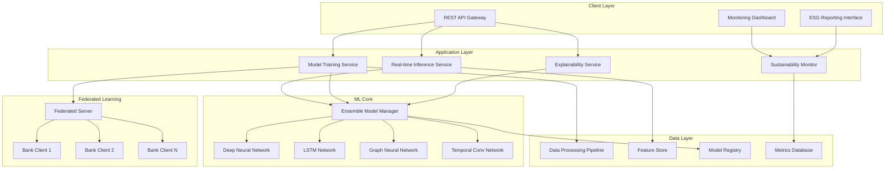

# Design Document

## Overview

The Sustainable Credit Risk AI system is designed as a modular, scalable platform that combines multiple neural network architectures with federated learning capabilities, comprehensive explainability features, and sustainability monitoring. The system follows a microservices architecture to enable independent scaling and deployment of different components while maintaining data privacy and regulatory compliance.

## Architecture

### High-Level System Architecture



### Component Architecture

The system is organized into six main layers:

1. **Client Layer**: User interfaces and external integrations
2. **Application Layer**: Business logic and service orchestration
3. **ML Core**: Neural network implementations and model management
4. **Federated Learning**: Distributed training coordination
5. **Data Layer**: Data processing, storage, and feature management
6. **Infrastructure Layer**: Deployment, monitoring, and security

## Components and Interfaces

### 1. Data Processing Pipeline

**Purpose**: Handle data ingestion, preprocessing, and feature engineering for multiple data sources.

**Key Components**:
- **Data Ingester**: Handles multiple data formats (CSV, JSON, Parquet) from banking systems
- **Feature Engineer**: Implements behavioral, financial, temporal, and relational feature extraction
- **Data Validator**: Ensures data quality and detects anomalies
- **Synthetic Data Generator**: Uses CTGAN for privacy-preserving data augmentation

**Interfaces**:
```python
class DataProcessor:
    def ingest_data(self, source: DataSource) -> RawDataset
    def validate_data(self, dataset: RawDataset) -> ValidationReport
    def engineer_features(self, dataset: RawDataset) -> FeatureDataset
    def generate_synthetic(self, dataset: FeatureDataset, samples: int) -> SyntheticDataset
```

### 2. Neural Network Models

**Purpose**: Implement multiple PyTorch-based neural architectures for credit risk prediction.

**Deep Neural Network (DNN)**:
- Multi-layer feedforward architecture
- Batch normalization and dropout for regularization
- Configurable layer sizes and activation functions

**LSTM Network**:
- Bidirectional LSTM for temporal sequence modeling
- Handles variable-length payment and spending sequences
- Attention mechanism for interpretability

**Graph Neural Network (GNN)**:
- Graph convolution layers for relational data
- Models borrower relationships and institutional connections
- Graph attention networks for dynamic relationship weighting

**Temporal Convolutional Network (TCN)**:
- Dilated causal convolutions for efficient sequence processing
- Lower computational cost alternative to LSTM
- Parallelizable training and inference

**Interfaces**:
```python
class BaseModel(nn.Module):
    def forward(self, x: torch.Tensor) -> torch.Tensor
    def get_feature_importance(self) -> Dict[str, float]
    def explain_prediction(self, x: torch.Tensor) -> ExplanationResult

class EnsembleModel:
    def add_model(self, model: BaseModel, weight: float)
    def predict(self, x: torch.Tensor) -> PredictionResult
    def get_model_contributions(self, x: torch.Tensor) -> Dict[str, float]
```

### 3. Federated Learning Framework

**Purpose**: Enable privacy-preserving collaborative training across multiple banking institutions.

**Federated Server**:
- Coordinates global model aggregation using FedAvg algorithm
- Manages client registration and communication
- Implements secure aggregation protocols

**Federated Client**:
- Local model training on institution-specific data
- Gradient encryption and differential privacy
- Model update transmission to central server

**Privacy Mechanisms**:
- Differential privacy with configurable epsilon values
- Secure multi-party computation for aggregation
- Homomorphic encryption for sensitive deployments

**Interfaces**:
```python
class FederatedServer:
    def register_client(self, client_id: str, public_key: str)
    def aggregate_updates(self, client_updates: List[ModelUpdate]) -> GlobalModel
    def distribute_model(self, model: GlobalModel) -> bool

class FederatedClient:
    def train_local_model(self, epochs: int) -> ModelUpdate
    def apply_differential_privacy(self, gradients: torch.Tensor, epsilon: float) -> torch.Tensor
    def encrypt_update(self, update: ModelUpdate) -> EncryptedUpdate
```

### 4. Explainability Service

**Purpose**: Provide comprehensive model interpretability for regulatory compliance and customer transparency.

**SHAP Integration**:
- Global and local feature importance calculation
- Deep SHAP for neural network explanations
- Visualization generation for reports

**LIME Implementation**:
- Local interpretable model-agnostic explanations
- Instance-level decision explanations
- Simplified linear approximations

**Attention Mechanisms**:
- Built-in attention weights from LSTM and GNN models
- Temporal attention visualization
- Feature attention heatmaps

**Interfaces**:
```python
class ExplainabilityService:
    def explain_prediction(self, model: BaseModel, input_data: torch.Tensor) -> Explanation
    def generate_shap_values(self, model: BaseModel, dataset: torch.Tensor) -> ShapValues
    def create_lime_explanation(self, model: BaseModel, instance: torch.Tensor) -> LimeExplanation
    def visualize_attention(self, model: BaseModel, sequence: torch.Tensor) -> AttentionPlot
```

### 5. Sustainability Monitor

**Purpose**: Track energy consumption, carbon emissions, and ESG metrics throughout the ML lifecycle.

**Energy Tracking**:
- Real-time GPU and CPU energy monitoring
- Training and inference energy measurement
- Carbon footprint calculation based on regional energy mix

**ESG Reporting**:
- Comprehensive sustainability metrics dashboard
- Automated report generation for stakeholders
- Integration with standard ESG frameworks

**Optimization Tracking**:
- Model compression impact measurement
- Efficiency improvement quantification
- ROI calculation for sustainability investments

**Interfaces**:
```python
class SustainabilityMonitor:
    def start_energy_tracking(self, experiment_id: str)
    def stop_energy_tracking(self, experiment_id: str) -> EnergyReport
    def calculate_carbon_footprint(self, energy_kwh: float, region: str) -> float
    def generate_esg_report(self, time_period: DateRange) -> ESGReport
```

### 6. Model Optimization Pipeline

**Purpose**: Implement sustainable AI techniques to reduce model size and energy consumption.

**Pruning Module**:
- Magnitude-based weight pruning
- Structured pruning for entire neurons/channels
- Iterative pruning during fine-tuning

**Quantization Module**:
- Quantization-Aware Training (QAT)
- Post-training static and dynamic quantization
- INT8 conversion with minimal accuracy loss

**Knowledge Distillation**:
- Teacher-student model training
- Temperature-scaled softmax for soft targets
- Compressed model generation

**Interfaces**:
```python
class ModelOptimizer:
    def prune_model(self, model: BaseModel, sparsity: float) -> PrunedModel
    def quantize_model(self, model: BaseModel, method: QuantizationMethod) -> QuantizedModel
    def distill_knowledge(self, teacher: BaseModel, student: BaseModel) -> DistilledModel
```

## Data Models

### Core Data Structures

**Credit Application**:
```python
@dataclass
class CreditApplication:
    application_id: str
    applicant_id: str
    loan_amount: float
    loan_term: int
    annual_income: float
    employment_length: int
    home_ownership: str
    debt_to_income_ratio: float
    credit_history_length: int
    behavioral_features: Dict[str, float]
    temporal_features: List[Dict[str, float]]
    relational_features: Dict[str, List[str]]
    timestamp: datetime
```

**Prediction Result**:
```python
@dataclass
class PredictionResult:
    application_id: str
    risk_score: float
    risk_category: str  # 'low', 'medium', 'high'
    confidence: float
    model_contributions: Dict[str, float]
    feature_importance: Dict[str, float]
    explanation: ExplanationResult
    processing_time_ms: float
    energy_consumed_mwh: float
```

**Training Metrics**:
```python
@dataclass
class TrainingMetrics:
    experiment_id: str
    model_type: str
    epoch: int
    train_loss: float
    val_loss: float
    auc_roc: float
    f1_score: float
    precision: float
    recall: float
    energy_consumed_kwh: float
    carbon_emissions_kg: float
    training_time_seconds: float
```

### Database Schema

**Feature Store Schema**:
- `features` table: Stores engineered features with versioning
- `feature_metadata` table: Feature definitions and statistics
- `feature_lineage` table: Tracks feature derivation and dependencies

**Model Registry Schema**:
- `models` table: Model metadata and performance metrics
- `model_versions` table: Version control and deployment history
- `model_artifacts` table: Serialized model files and configurations

**Metrics Database Schema**:
- `training_runs` table: Training experiment tracking
- `inference_logs` table: Real-time prediction logging
- `sustainability_metrics` table: Energy and carbon tracking
- `explainability_cache` table: Cached explanation results

## Error Handling

### Error Categories and Strategies

**Data Processing Errors**:
- **Missing Data**: Implement configurable imputation strategies (mean, median, forward-fill, model-based)
- **Data Quality Issues**: Validate data ranges, detect outliers, flag inconsistencies
- **Schema Mismatches**: Flexible schema validation with automatic type conversion
- **Recovery Strategy**: Graceful degradation with partial feature sets

**Model Training Errors**:
- **Convergence Issues**: Adaptive learning rate scheduling and early stopping
- **Memory Errors**: Gradient accumulation and batch size optimization
- **Numerical Instability**: Mixed precision training with gradient scaling
- **Recovery Strategy**: Checkpoint-based recovery and hyperparameter adjustment

**Federated Learning Errors**:
- **Client Disconnection**: Asynchronous aggregation with timeout handling
- **Model Divergence**: FedProx algorithm for handling heterogeneous data
- **Communication Failures**: Retry mechanisms with exponential backoff
- **Recovery Strategy**: Robust aggregation with client dropout tolerance

**Inference Errors**:
- **Model Loading Failures**: Fallback to previous model versions
- **Input Validation Errors**: Comprehensive input sanitization and validation
- **Latency Violations**: Circuit breaker pattern with cached responses
- **Recovery Strategy**: Multi-model ensemble with automatic failover

### Error Monitoring and Alerting

```python
class ErrorHandler:
    def handle_data_error(self, error: DataError) -> ErrorResponse
    def handle_model_error(self, error: ModelError) -> ErrorResponse
    def handle_federated_error(self, error: FederatedError) -> ErrorResponse
    def log_error(self, error: Exception, context: Dict[str, Any])
    def trigger_alert(self, severity: AlertLevel, message: str)
```

## Testing Strategy

### Testing Pyramid

**Unit Tests (70%)**:
- Individual component testing for all modules
- Mock external dependencies and data sources
- Test edge cases and error conditions
- Property-based testing for data transformations

**Integration Tests (20%)**:
- End-to-end pipeline testing
- Federated learning communication protocols
- API endpoint testing with realistic payloads
- Database integration and data consistency

**System Tests (10%)**:
- Performance benchmarking under load
- Sustainability metrics validation
- Explainability output verification
- Security and privacy compliance testing

### Test Implementation Strategy

**Model Testing**:
```python
class ModelTestSuite:
    def test_model_accuracy(self, model: BaseModel, test_data: Dataset)
    def test_model_fairness(self, model: BaseModel, protected_attributes: List[str])
    def test_model_robustness(self, model: BaseModel, adversarial_data: Dataset)
    def test_explanation_consistency(self, model: BaseModel, sample_data: Dataset)
```

**Performance Testing**:
- Load testing with concurrent inference requests
- Memory usage profiling during training and inference
- Energy consumption validation across different hardware
- Latency testing under various network conditions

**Security Testing**:
- Privacy preservation validation in federated learning
- Differential privacy parameter verification
- Encryption and secure communication testing
- Model inversion and membership inference attack resistance

### Continuous Testing Pipeline

- Automated testing on every code commit
- Model performance regression testing
- Sustainability metrics monitoring in CI/CD
- Explainability output validation
- Security vulnerability scanning

This design provides a comprehensive foundation for implementing the sustainable credit risk AI system while maintaining modularity, scalability, and adherence to all specified requirements.